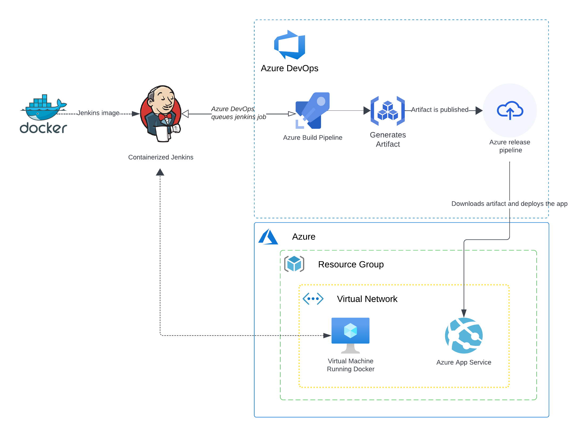
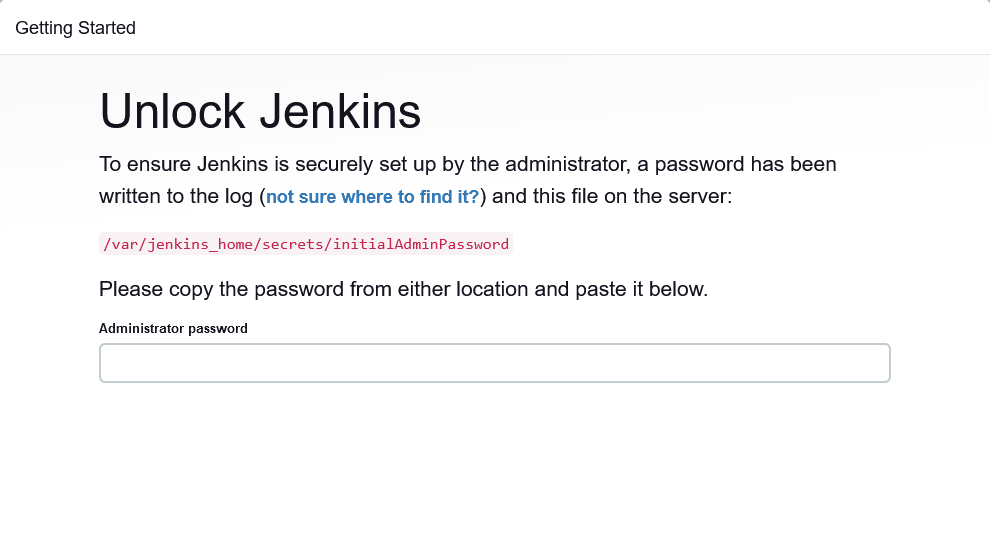
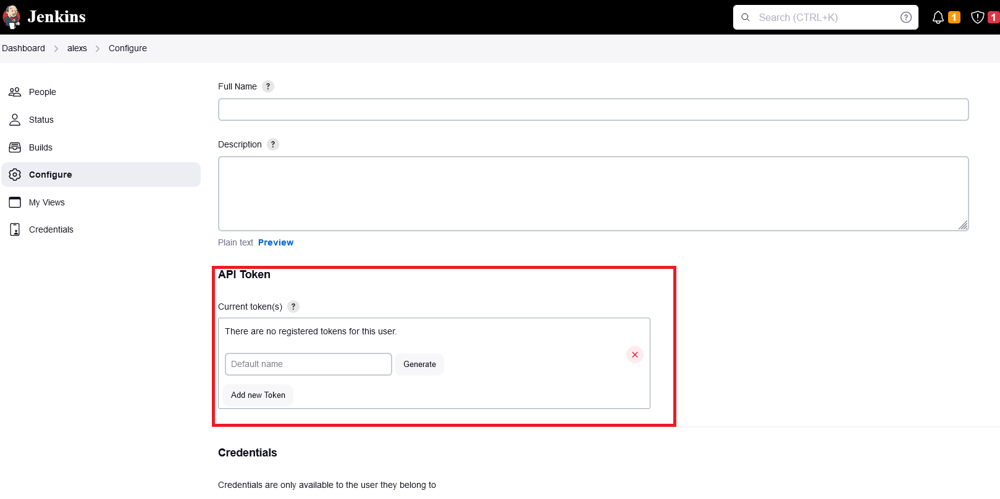
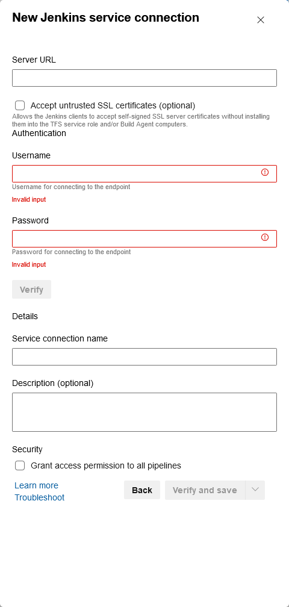
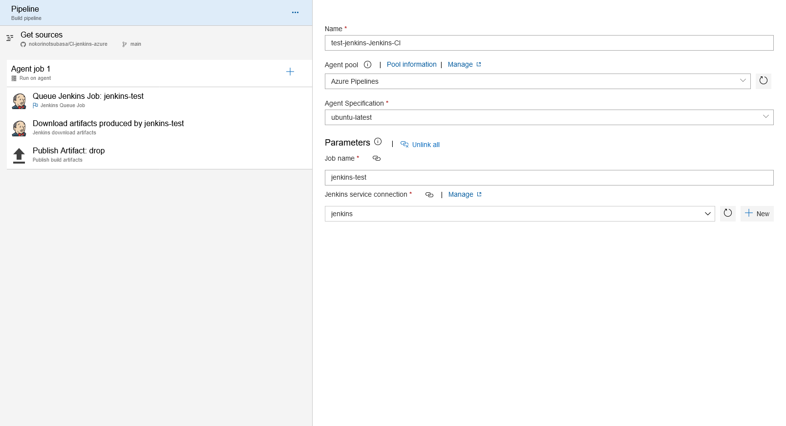
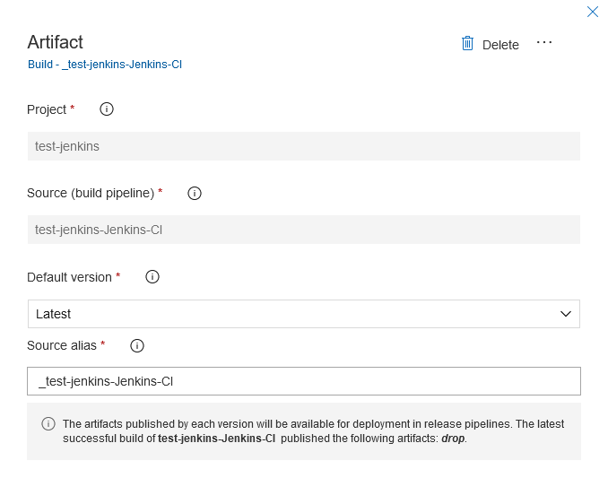
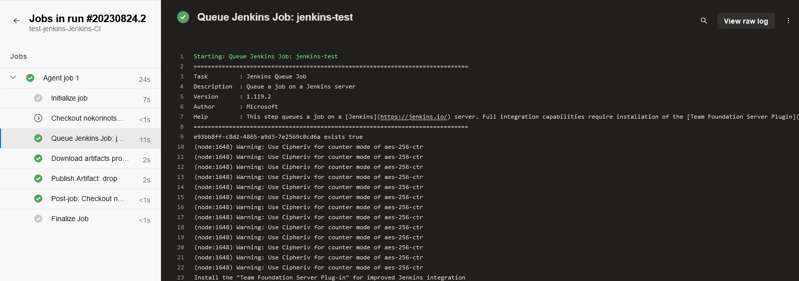
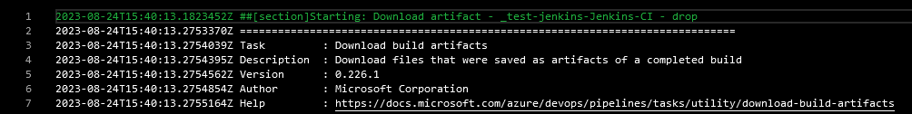

# Using Jenkins for Continuous Integration with Azure DevOps

## Table of Contents

- [Introduction](#introduction)
- [Architecture Overview](#architecture-overview)
- [Prerequisites](#prerequisites)
- [Terraform Setup](#terraform-setup)
  - [Important Notes](#important-notes-about-terraform)
- [Deployment Steps](#deployment-steps)
  - [1. Deploy Infrastructure with Terraform](#1-deploy-infrastructure-with-terraform)
  - [2. Jenkins Initial Setup](#2-jenkins-initial-setup)
  - [3. Configure Jenkins](#3-configure-jenkins)
    - [Generate API Token](#generate-api-token)
    - [Install GitHub Plugin](#install-github-plugin)
    - [Create Jenkins Pipeline Job](#create-jenkins-pipeline-job)
  - [4. Azure DevOps Setup](#4-azure-devops-setup)
    - [Create Project and Pipeline](#create-project-and-pipeline)
    - [Add Jenkins Service Connection](#add-jenkins-service-connection)
    - [Configure Azure DevOps Pipeline](#configure-azure-devops-pipeline)
  - [5. Create Release Pipeline in Azure DevOps](#5-create-release-pipeline-in-azure-devops)
- [Running the CI/CD Pipeline](#running-the-cicd-pipeline)
- [Expected Outcome](#final-result)

## Introduction

This guide demonstrates how to integrate Jenkins with Azure DevOps for Continuous Integration (CI) and Continuous Deployment (CD). We will use Jenkins to build a Python Flask application, generate artifacts, and then use Azure Pipelines to download these artifacts and deploy them.

**Note:** For demonstration purposes, the Jenkins pipeline will run on the Jenkins master node. In a production environment, it is highly recommended to use Jenkins agents for build processes.

## Architecture Overview

The following diagram illustrates the high-level architecture of this CI/CD setup:



1.  **Terraform:** Provisions all necessary Azure resources (Virtual Machine for Jenkins, Networking, etc.).
2.  **Jenkins:**
    *   Runs inside a Docker container on the Azure VM.
    *   Fetches source code from a GitHub repository.
    *   Builds the Python Flask application and publishes artifacts.
3.  **Azure DevOps:**
    *   Triggers the Jenkins job.
    *   Downloads the build artifacts from Jenkins.
    *   Deploys the application to a target environment via a Release Pipeline.

The application details are now generic.

## Prerequisites

Before you begin, ensure you have the following:
*   An Azure subscription.
*   Azure CLI installed and configured.
*   Terraform CLI installed.
*   A GitHub account and a repository containing your application code and Jenkinsfile.
*   An Azure DevOps organization and project.

## Terraform Setup

Terraform is used to automate the deployment of all Azure resources.

### Important Notes about Terraform

*   **Configuration:** Before running Terraform, you **must** update the `terraform/terraform.tfvars` file with your specific values, especially for `vm_secrets.admin_username`.
*   **Also, add your subscription ID to the main.tf file** in the `terraform` directory:
    ```hcl
    provider "azurerm" {
      features {}
      subscription_id = "<YOUR_SUBSCRIPTION_ID>"
    }
    ```
    And change the ADMIN_USERNAME in the `terraform.tfvars` file to your admin username:
    ```hcl
    vm_secrets = {
      admin_username = "<ADMIN-USERNAME>"
    }
    ```
*   **VM Password:** The virtual machine's administrator password is randomly generated by Terraform. It will **not** be displayed in the Terraform output. You can find this password securely stored in the `terraform/terraform.tfstate` file after a successful `terraform apply`. **Handle this file with care as it contains sensitive information.**
*   **State File:** It is recommended to configure a remote backend for your Terraform state file in a production environment (e.g., Azure Blob Storage) for better security and team collaboration (We won't cover this here).

> ALL the scripts can be found in the root directory of this repository.

## Deployment Steps

Follow these steps to set up the complete CI/CD pipeline:

### 1. Deploy Infrastructure with Terraform

1.  Navigate to the `terraform` directory:
    ```bash
    cd terraform
    ```
2.  Initialize Terraform:
    ```bash
    terraform init
    ```
3.  Review the execution plan:
    ```bash
    terraform plan
    ```
4.  Apply the Terraform configuration to create the Azure resources:
    ```bash
    terraform apply
    ```
    Confirm the deployment by typing `yes` when prompted.

    This process will:
    *   Create a resource group.
    *   Set up a virtual network and subnet.
    *   Deploy a Linux Virtual Machine.
    *   Install Jenkins via a custom Docker container (with necessary dependencies) using a VM extension and a custom script (`script.sh` - ensure this script is correctly configured and accessible via the `fileUris` in `terraform.tfvars`).

### 2. Jenkins Initial Setup

1.  **Get VM Public IP:** Obtain the public IP address of the Jenkins VM from the Terraform output or the Azure portal.
    ```bash
    terraform output ip_address_master_vm
    ```
2.  **Access Jenkins:** Open your web browser and navigate to `http://<JENKINS_VM_PUBLIC_IP>:8080`.
3.  **Unlock Jenkins:** Jenkins requires an initial administrator password to unlock it. You can retrieve this password by SSHing into the VM and viewing the Jenkins container logs:
    *   SSH into the VM (you'll need the admin username from `terraform.tfvars` and the password from `terraform.tfstate`).
    *   Execute the following command:
        ```bash
        sudo docker logs jenkins
        ```
    *   Copy the alphanumeric password displayed in the logs.
    
4.  Paste the password into the "Administrator password" field in your browser and click "Continue."
5.  Follow the on-screen instructions to install suggested plugins and create an admin user.

### 3. Configure Jenkins

#### IMPORTANT: Jenkins and Docker

The build process will run on docker, and even though the Jenkins master is running on Docker
itself, it does mean that the Jenkins container has docker installed and configured.

#### Prerequisites for Jenkins Configuration

Since we Already logged into the VM, run:

```bash
docker exec -it --user root "<JENKINS_CONTAINER_NAME>" /bin/bash
```

to access the container with root privileges, then follow the official documentation to install
docker:

https://docs.docker.com/engine/install/debian/#install-using-the-repository

#### Docker Pipelines plugin:

Ensure the Docker Pipelines plugin is installed in Jenkins for the pipeline to run inside a Docker container.
(Since we are running python:3.13 image on the Jenkinsfile, the plugin is necessary.)

#### Generate API Token

An API token is required for Azure DevOps to securely connect to Jenkins.

1.  Log in to Jenkins with your admin user.
2.  Go to `Manage Jenkins` > `Users`.
3.  Click on your username, then `Configure` (or `Settings`).
4.  Under the `API Token` section, click `Add new Token`.
5.  Give the token a name (e.g., `azure-devops-token`) and click `Generate`.
6.  **Copy the generated token immediately and save it in a secure location.** You will not be able to see it again.



#### Install GitHub Plugin

Ensure the GitHub plugin is installed to allow Jenkins to fetch code from your GitHub repository.
1.  Go to `Manage Jenkins` > `Manage Plugins`.
2.  Go to the `Available` tab and search for "GitHub Integration".
3.  Select the plugin and click `Install without restart` (or similar).

#### Create Jenkins Pipeline Job

1.  On the Jenkins dashboard, click `New Item`.
2.  Enter a name for your job (e.g., `MyWebApp-CI`).
3.  Select `Pipeline` as the job type and click `OK`.
4.  **Pipeline Configuration:**
    *   Scroll down to the `Pipeline` section.
    *   For `Definition`, select `Pipeline script from SCM`.
    *   **SCM:** Choose `Git`.
    **Repository URL:** Enter the HTTPS URL of your GitHub repository (e.g., `https://github.com/your-username/your-repo.git`).
    **IMPORTANT:** Replace the example URL below with the URL of **your own** GitHub repository.
    here we will use https://github.com/alexsander-projects/CI-jenkins-azure 

    *   **Credentials:** Add your GitHub credentials if your repository is private.
    *   **Branch Specifier:** Specify the branch to build from (e.g., `*/main` or `*/master`).
    *   **Script Path:** Enter the name of your Jenkinsfile (e.g., `Jenkinsfile`).
5.  Click `Save`.

> The Jenkinsfile used is available in the root of this repository. It contains the pipeline script that builds the Python Flask application and archives the artifacts.

### 4. Azure DevOps Setup

#### Create Project and Pipeline

1.  In Azure DevOps, create a new project if you haven't already.

#### Add Jenkins Service Connection

1.  Go to `Project Settings` (bottom-left corner).
2.  Under `Pipelines`, select `Service connections`.
3.  Click `New service connection`.
4.  Search for `Jenkins` and click `Next`.
5.  **Configuration:**
    *   **Server URL:** `http://<JENKINS_VM_PUBLIC_IP>:8080` (replace `<JENKINS_VM_PUBLIC_IP>` with your VM's IP).
    *   **Username:** Your Jenkins admin username.
    *   **Password/Token:** Paste the Jenkins API token you generated earlier. **Do not use your Jenkins password.**
    *   **Service connection name:** Give it a descriptive name (e.g., `MyJenkinsConnection`).
    *   Grant access permission to all pipelines.

    

6.  Click `Verify` to test the connection.
7.  Click `Verify and save`.

#### Configure Azure DevOps Pipeline

1.  When creating your new Azure DevOps pipeline, choose the **Classic editor** to use the Jenkins template.
2.  **Select a source:** Choose `GitHub` (or your SCM provider) and configure the repository and branch that contains your `Jenkinsfile` (this might seem redundant but is often how classic editor templates start).
3.  **Select a template:** Search for and select the `Jenkins` template. Click `Apply`.
4.  **Pipeline Settings:**
    *   **Agent pool:** Choose an appropriate agent pool (e.g., `Azure Pipelines`).
    *   **Agent Specification:** Select an agent specification (e.g., `ubuntu-latest`).
5.  **"Queue Jenkins Job" Task:**
    *   **Jenkins service connection:** Select the Jenkins service connection you created.
    *   **Job name:** Enter the exact name of the Jenkins pipeline job you created in Jenkins (e.g., `MyWebApp-CI`).
THIS IS CRUCIAL as it tells Azure DevOps which Jenkins job to trigger.
    *   You can leave other options as default or configure them as needed (e.g., capture console output).
    
6.  **"Download Jenkins Artifacts" Task:**
    * This task should be automatically added by the template.
    * **Jenkins service connection:** Ensure it's the correct one.
    * **Job name:** Ensure it's the correct Jenkins job name.
    * **Artifact name:** This should match the artifact name defined in your `Jenkinsfile` (e.g., `artifacts.zip`).
    * **Save to:** Specify where the artifacts should be downloaded (e.g., `$(Build.ArtifactStagingDirectory)`
    You can also click on the three dots to browse and select the artifact location).
7.  Click `Save & queue` to save the pipeline and run it for the first time.

Now the Azure DevOps pipeline is set up to trigger the Jenkins job, which will build the Python application on Jenkins
and archive the artifacts.

### 5. Create a Release Pipeline in Azure DevOps

> This assumes you have the Azure Resource Manager Service Connection set up in Azure DevOps.

This pipeline will take the artifacts downloaded from Jenkins and deploy them to a target environment. Since the application is now a generic Python Flask app, the deployment can vary. Below is a general approach; you'll need to adapt it to your specific deployment target and strategy (e.g., deploying to a VM, container service, etc.).

1.  In Azure DevOps, navigate to `Pipelines` > `Releases`.
2.  Click `New pipeline`.
3.  **Select a template:** Start with an `Empty job`.
4.  **Artifacts:**
    *   Click `+ Add an artifact`.
    *   **Source type:** Select `Build`.
    *   **Project:** Select your current Azure DevOps project.
    *   **Source (build pipeline):** Select the Azure DevOps pipeline you created in the previous step (the one that queues the Jenkins job).
    *   **Default version:** Choose `Latest`.
    *   **Source alias:** You can leave the default or give it a descriptive name (e.g., `_JenkinsBuildOutput`).
    *   Click `Add`.
    
5.  **Stages:**
    *   Click on the default stage (e.g., `Stage 1`).
    *   Rename the stage if desired (e.g., `DeployToTarget`).
    *   Click on the `1 job, 0 task` link (or similar) to configure the deployment tasks.
6.  **Add Deployment Tasks:**
    *   Add the app service deployment tasks based on your target environment and choose the artifact accordingly.
7.  Configure the tasks with the necessary details (server connections, paths, commands).
8.  Click `Save`.
9.  Click `Create release` and then `Create` to deploy the application.

## Running the CI/CD Pipeline

1.  Make a change to your application code in the GitHub repository and push the commit.
2.  The Azure DevOps pipeline should automatically trigger (if CI triggers are enabled for the branch).
3.  The Azure DevOps pipeline will queue the Jenkins job.
    
4.  Jenkins will build the application and archive the artifacts.
5.  The Azure DevOps pipeline will download the artifacts from Jenkins.
    
6.  If you have continuous deployment triggers enabled on your Release Pipeline, it will automatically start. Otherwise, manually create a new release to deploy the latest build.
7.  The Release Pipeline will deploy the `artifacts.zip` to the target environment.

## Final Result

Once the release pipeline completes successfully, you can access your deployed Python application.
1. Open the App service URL in your browser to see the website.
> In this instance, the application is a simple Python Flask app that displays "Hello, this is a Python web app!".

You have now successfully integrated Jenkins with Azure DevOps for CI/CD!
